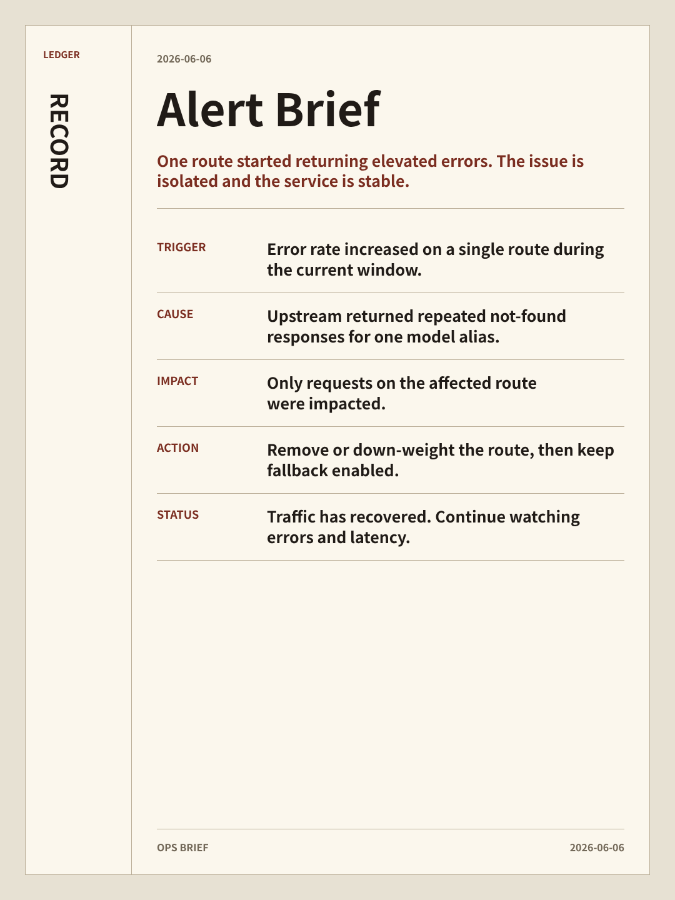
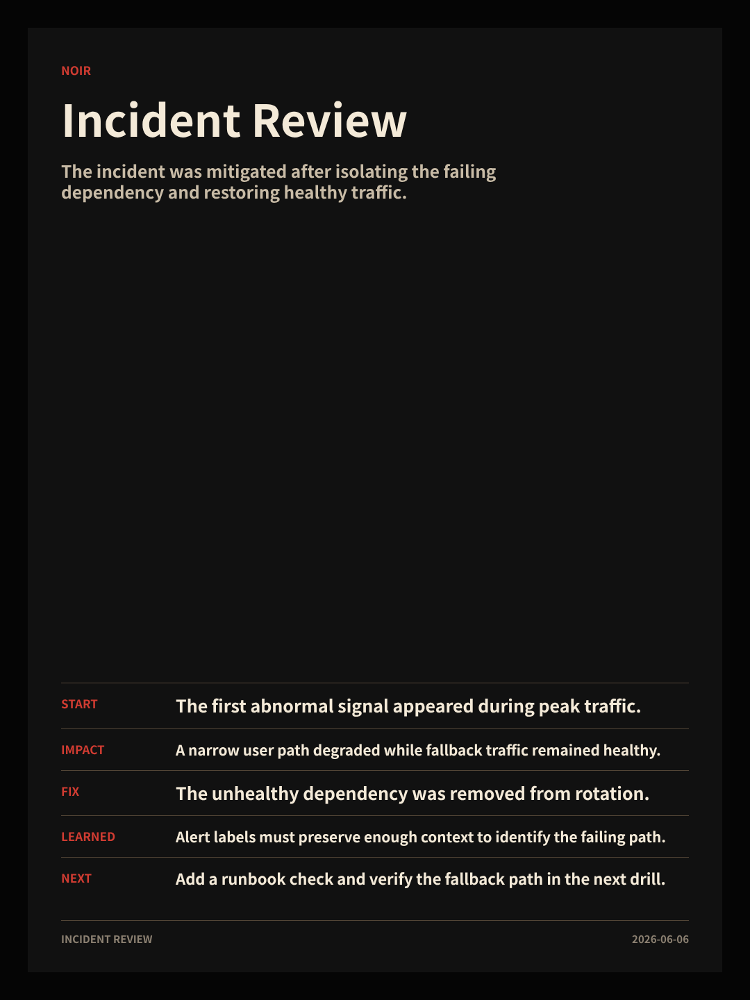
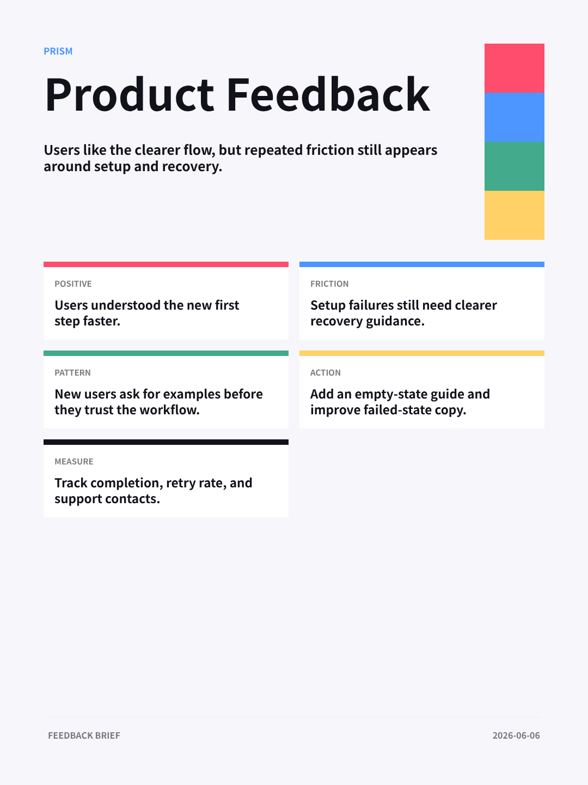
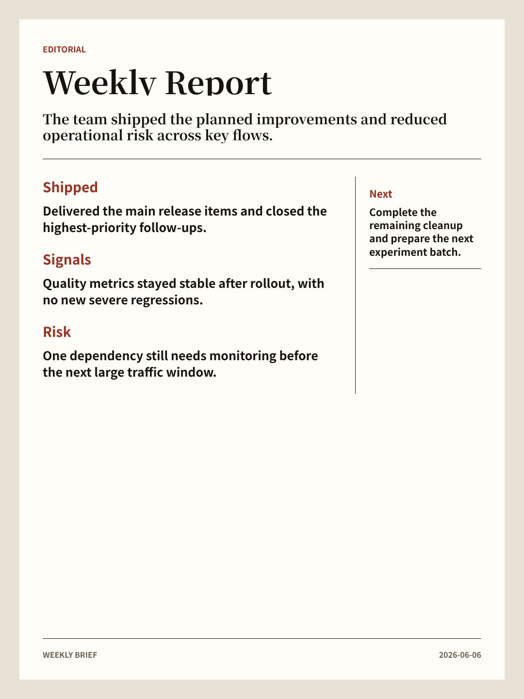
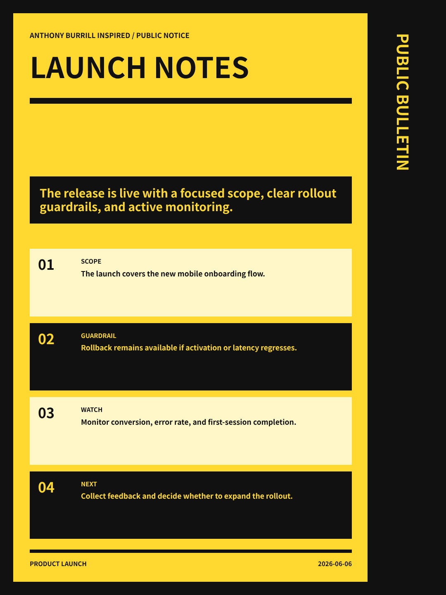
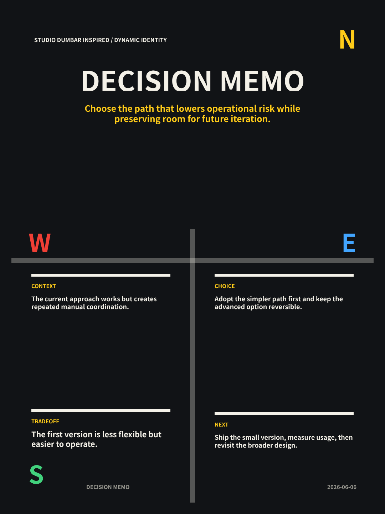
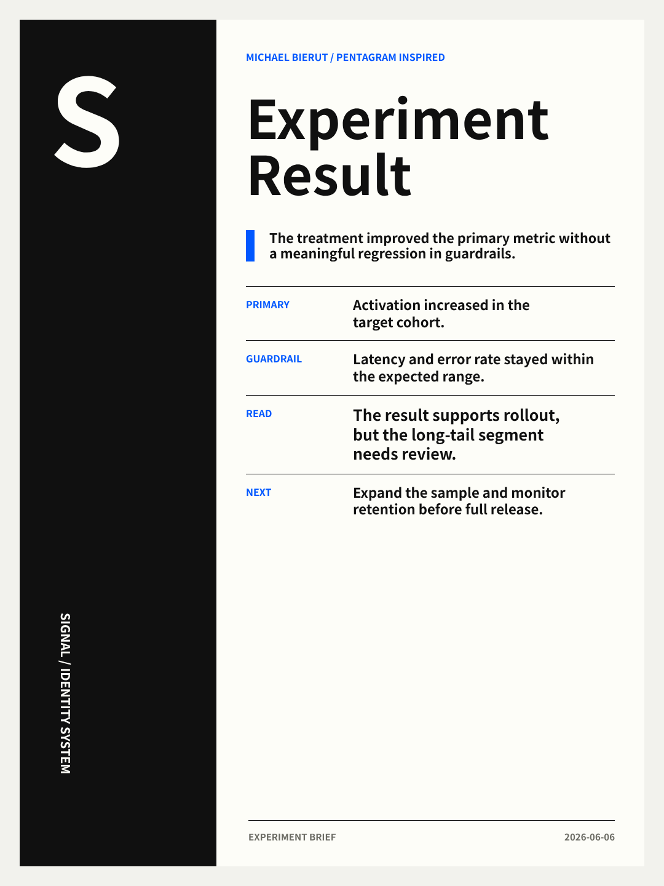
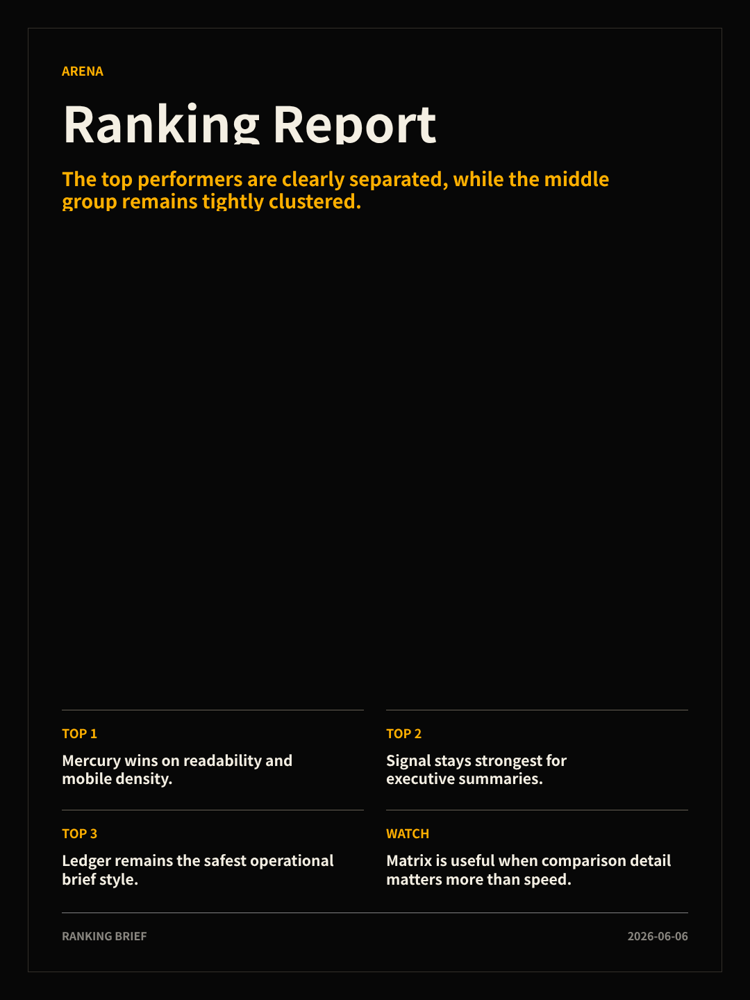
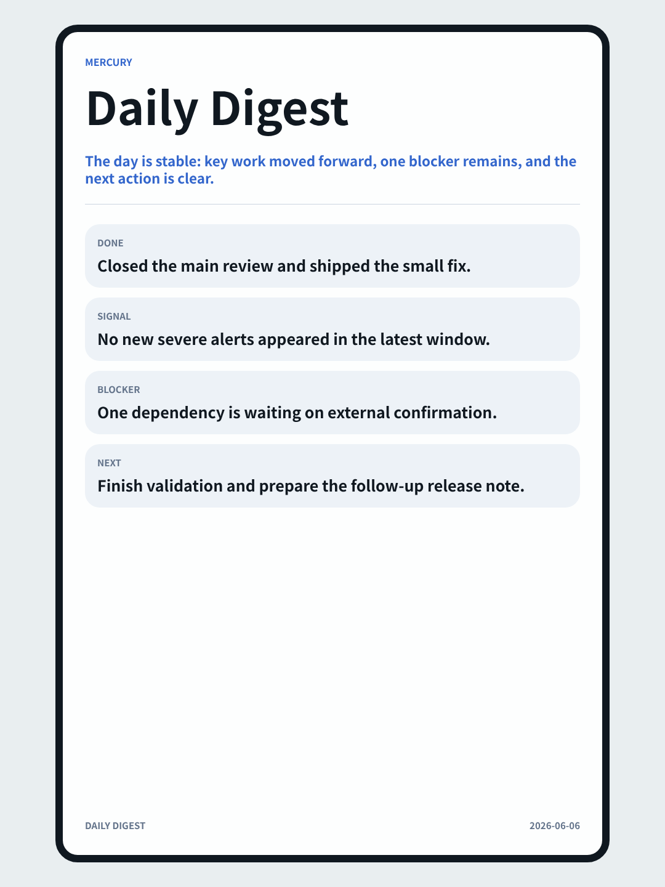
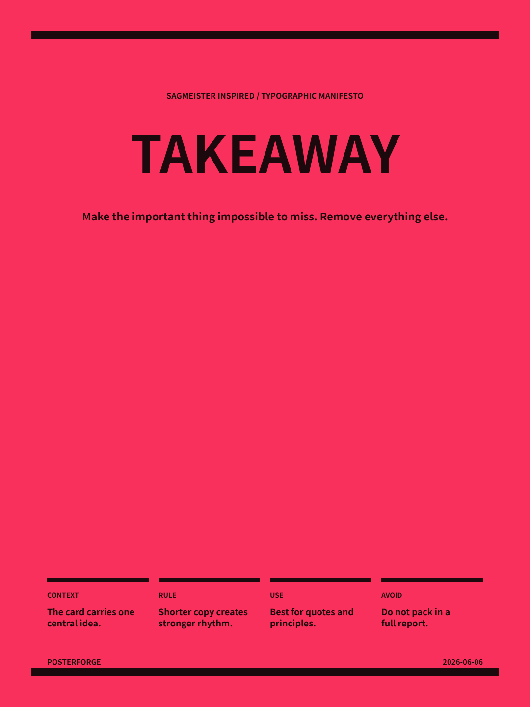

# PosterForge Skill

[中文说明](README.zh-CN.md)

[](https://github.com/sumingcheng/posterforge-skill/actions/workflows/ci.yml)
[](https://github.com/sumingcheng/posterforge-skill/tags)
[](LICENSE)
[](package.json)
[](package.json)

Turn quick CLI parameters or a tiny JSON spec into polished mobile-first text posters for agents, bots, alerts, reports, rankings, and social cards.

PosterForge Skill is not a design app, image generation model, PPT tool, or carousel builder. It is an agent-friendly text poster renderer: direct command-line input, deterministic layout, high-DPI PNG output, and reusable visual systems.

| Alert Brief | Incident Review | Product Feedback |
| --- | --- | --- |
|  |  |  |

## 30-Second Start

```bash
npm install -g posterforge
```

The fastest path does not require a JSON file. Pass the card content directly:

```bash
posterforge render \
  --style signal \
  --title "Service Health" \
  --summary "Errors dropped after the routing fix. Latency is back within the normal range." \
  --item "Impact: Only one provider route was affected." \
  --item "Action: Keep the fallback route enabled and monitor for one hour." \
  --item "Status: Traffic is stable and no new alerts are firing." \
  --out card.png
```

By default this exports a `3240x4320` PNG from a `1080x1440` logical canvas.

Use JSON when you want a stable, reusable spec. Create `card.json`:

```json
{
  "style": "signal",
  "title": "Service Health",
  "summary": "Errors dropped after the routing fix. Latency is back within the normal range.",
  "content": [
    { "title": "Impact", "text": "Only one provider route was affected." },
    { "title": "Action", "text": "Keep the fallback route enabled and monitor for one hour." },
    { "title": "Status", "text": "Traffic is stable and no new alerts are firing." }
  ],
  "footer": "Ops Brief"
}
```

Render:

```bash
posterforge render card.json --out card.png
```

Generate a reusable JSON spec from quick parameters:

```bash
posterforge spec \
  --style ledger \
  --title "Alert Brief" \
  --summary "Kong 4xx increased on one route." \
  --item "Cause: Upstream returned model-not-found." \
  --out card.json
```

## Why PosterForge

| Need | PosterForge approach |
| --- | --- |
| Agents need predictable output | Uses a tiny `CardSpec` instead of free-form HTML or image prompts. |
| Text cards must stay readable | Every style has a conservative text budget. |
| Workflows need speed and repeatability | Rendering is local and deterministic once dependencies are installed. |
| Teams need many looks | 20 built-in style systems, each selected by a short style name. |
| Contributors need a clean path | New styles live in one registry and one template pack. |

## Use Cases

| Use case | Example | Good styles |
| --- | --- | --- |
| Alert root-cause summary | [examples/alert.json](examples/alert.json), [examples/incident-brief.json](examples/incident-brief.json) | `ledger`, `audit`, `terminal`, `noir` |
| Ranking or battle report | [examples/battle-ranking.json](examples/battle-ranking.json) | `arena`, `podium`, `sprint`, `matrix` |
| Experiment or KPI update | [examples/experiment.json](examples/experiment.json) | `signal`, `prism`, `atlas`, `mercury` |
| Weekly team brief | [examples/weekly-brief.json](examples/weekly-brief.json) | `editorial`, `signal`, `atlas` |
| Product launch update | [examples/product-update.json](examples/product-update.json) | `signal`, `bulletin`, `compass` |

## Scenario Presets

Presets are ready-made content blueprints for common agent tasks. They create a standard `CardSpec` first; you can keep the default style or override it.

```bash
posterforge presets
posterforge preset incident-review --out incident.json
posterforge render --preset alert-brief --out alert.png
posterforge render --preset launch-notes --style mercury --out launch.png
```

Built-in presets:

| Preset | Default style | Best for |
| --- | --- | --- |
| `alert-brief` | `ledger` | alert triage and root-cause notes |
| `incident-review` | `noir` | incident summaries and postmortem snapshots |
| `weekly-report` | `editorial` | weekly updates and leadership summaries |
| `launch-notes` | `bulletin` | release notes and launch announcements |
| `decision-memo` | `compass` | architecture decisions and product trade-offs |
| `experiment-result` | `signal` | experiments and KPI movement |
| `ranking-report` | `arena` | leaderboards and battle reports |
| `product-feedback` | `prism` | survey and feedback synthesis |
| `daily-digest` | `mercury` | daily status cards |
| `quote-card` | `pulse` | short principles and social quotes |

Preset cover gallery:

| Alert Brief | Incident Review | Weekly Report |
| --- | --- | --- |
|  |  |  |

| Launch Notes | Decision Memo | Experiment Result |
| --- | --- | --- |
|  |  |  |

| Ranking Report | Product Feedback | Daily Digest |
| --- | --- | --- |
|  |  |  |

| Quote Card |
| --- |
|  |

See [docs/PRESETS.md](docs/PRESETS.md) for the full preset guide.

Render bundled examples:

```bash
pnpm render:alert
pnpm render:incident
pnpm render:weekly
pnpm render:product
```

## Theme Gallery

These previews are generated from the same JSON shape with `pnpm generate:previews`.

| Arena | Podium | Sprint |
| --- | --- | --- |
|  |  |  |

| Delta | Matrix | Heat |
| --- | --- | --- |
|  |  |  |

| Ledger | Dossier | Audit |
| --- | --- | --- |
|  |  |  |

| Terminal | Bulletin | Noir |
| --- | --- | --- |
|  |  |  |

| Graphite | Signal | Pulse |
| --- | --- | --- |
|  |  |  |

| Atlas | Prism | Compass |
| --- | --- | --- |
|  |  |  |

| Mercury | Editorial |
| --- | --- |
|  |  |

## Install

Requirements:

- Node.js `>=20`
- `pnpm` for development
- Chromium, Google Chrome, or another compatible headless browser for high-DPI PNG export

Install directly from GitHub:

```bash
npm install -g github:sumingcheng/posterforge-skill
```

Install from npm:

```bash
npm install -g posterforge
```

Use the repository directly:

```bash
git clone https://github.com/sumingcheng/posterforge-skill.git
cd posterforge-skill
pnpm install
pnpm build
node ./bin/posterforge.mjs render ./examples/alert.json --out ./dist/alert.png
```

Expose the local CLI while developing:

```bash
npm install -g .
posterforge templates
```

## CLI

Render from a JSON spec:

```bash
posterforge render card.json --out card.png
```

Render from direct parameters:

```bash
posterforge render --style mercury --title "Launch Notes" --summary "The release is ready." --item "Scope: Mobile onboarding." --item "Next: Watch activation." --out launch.png
```

Create a starter spec:

```bash
posterforge init --style signal --out card.json
```

Create a scenario preset spec:

```bash
posterforge preset alert-brief --out card.json
```

List available styles:

```bash
posterforge templates
```

List available scenario presets:

```bash
posterforge presets
```

Print the bundled skill file path for agent runtimes:

```bash
posterforge skill-path
```

## Agent And Skill Usage

This project includes a skill definition in [skill/SKILL.md](skill/SKILL.md). Use it with OpenClaw, Codex, Claude, or any agent runtime that can read a skill file and call local commands.

Recommended flow:

1. Compress source material into `CardSpec`.
2. Pick a style by intent.
3. Check [docs/TEXT_BUDGETS.md](docs/TEXT_BUDGETS.md).
4. Render the PNG.
5. Inspect the image before returning it.

The agent should not announce that it is using the skill. It should simply produce the image.

See [docs/AGENT_USAGE.md](docs/AGENT_USAGE.md) for the full agent integration guide.

## CardSpec

The recommended input is intentionally small:

```ts
type CardSpec = {
  style: string;
  title: string;
  summary: string;
  content: Array<{ title: string; text: string }> | string[] | string;
  footer?: string;
};
```

New specs should prefer `title`, `summary`, and `content`. Legacy `metrics`, `rankings`, and `sections` are still accepted and normalized into `content`.

Read the full schema in [docs/CARD_SPEC.md](docs/CARD_SPEC.md).

## Styles

Use `style` to pick a visual system:

| Group | Styles | Best for |
| --- | --- | --- |
| Ranking | `arena`, `podium`, `sprint`, `delta`, `matrix`, `heat` | battle reports, leaderboards, top lists |
| Operations | `ledger`, `dossier`, `audit`, `terminal`, `bulletin`, `noir`, `graphite` | alerts, incident notes, diagnosis summaries |
| Briefing | `signal`, `pulse`, `atlas`, `prism`, `compass`, `mercury`, `editorial` | KPI reports, experiments, weekly updates |

List all registered templates:

```bash
posterforge templates
```

## Text Budgets

Each style has a conservative text budget. Agents should check it before rendering, because these templates are fixed poster layouts and long text will damage the design.

The renderer also applies a text-fit guard before screenshot export: constrained text blocks get safer wrapping and small automatic font-size reductions when they would otherwise overflow. This is a protection layer, not a replacement for concise input.

See [docs/TEXT_BUDGETS.md](docs/TEXT_BUDGETS.md) for per-style limits.

Short version:

- keep titles short
- keep summaries to one compact paragraph
- keep content points brief
- compress raw logs or transcripts before rendering
- rerender if the output looks clipped or crowded

## Architecture

```text
CardSpec JSON
  -> schema normalization
  -> template registry
  -> React/HTM templates
  -> Tailwind CSS
  -> high-DPI Chromium PNG
```

Important files:

- [src/schema/card-spec.mjs](src/schema/card-spec.mjs): input normalization
- [src/templates/style-pack.mjs](src/templates/style-pack.mjs): template implementations
- [src/templates/registry.mjs](src/templates/registry.mjs): style registry
- [bin/posterforge.mjs](bin/posterforge.mjs): CLI renderer
- [docs/DESIGN_RESEARCH.md](docs/DESIGN_RESEARCH.md): design references

## Development

```bash
pnpm install
pnpm build
pnpm lint
pnpm check
pnpm dev
pnpm generate:previews
```

See [CONTRIBUTING.md](CONTRIBUTING.md) before adding a new style.

See [docs/PUBLISHING.md](docs/PUBLISHING.md) for npm release instructions.

## Design Principles

- One image by default.
- Text-first layouts.
- Strong typography over decoration.
- Small JSON input.
- No fake metrics.
- No raw transcripts.
- Conservative text budgets.
- High-DPI output by default.

## License

MIT. See [LICENSE](LICENSE).
